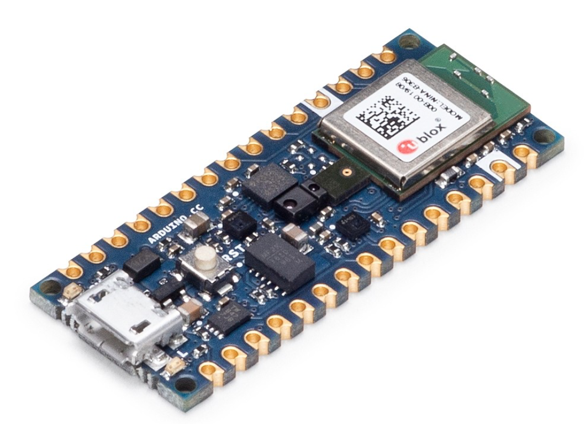

# [Your Project Title Here]

## Repository Link

[https://github.com/ArmanMarkosyan04/TinyMl-Keyword-Detection]

## Description

[the usage of different words, as well as silence and noise to complicate the word recognition task and bring this task closer to real conditions Objective]

### Task Type

[Keyword detection]

### Results Summary

- **Best Model:** [Name of the best-performing model]
- **Evaluation Metric:** [ right keyword detection accuracy]
- **Result:** [>90% average accuracy]

## Documentation

1. **[Literature Review](0_LiteratureReview/README.md)**
2. **[Dataset Characteristics](1_DatasetCharacteristics/exploratory_data_analysis.ipynb)**
3. **[Baseline Model](2_BaselineModel/baseline_model.ipynb)**
4. **[Model Definition and Evaluation](3_Model/model_definition_evaluation)**
5. **[Presentation](4_Presentation/README.md)**

## Cover Image

